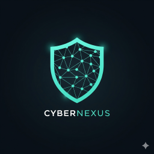

<p align="center">
  
</p>

<h1 align="center">CyberNexus TR 🇹🇷</h1>

<p align="center">
  <strong>Yapay Zeka Destekli, İnteraktif Siber Güvenlik Eğitim ve Analiz Platformu</strong>
  <br />
  <a href="https://cybernexus.mes41.site/" target="_blank"><strong>Canlı Demo »</strong></a>
</p>

---

## 💡 Proje Hakkında

**CyberNexus TR**, siber güvenlik alanındaki öğrencilerin ve profesyonellerin pratik yeteneklerini geliştirmeleri için tasarlanmış, baştan sona (full-stack) bir web platformudur. Bu proje, teorik bilgiyi gerçekçi senaryolarla birleştirerek, bir SOC analistinin günlük iş akışını simüle etmeyi ve bu süreçte yapay zekayı kişiselleştirilmiş bir mentor olarak konumlandırmayı hedefler.

Bu platform, kişisel bir ihtiyaçtan doğmuş ve Google'ın Gemini Pro modellerinin yoğun asistanlığıyla, konseptten tam özellikli bir ürüne dönüştürülmüştür. Amaç, modern web teknolojilerini kullanarak siber güvenlik eğitiminde karşılaşılan pratik yapma eksikliğini gidermek ve öğrenme sürecini dinamik, ilgi çekici ve kişiye özel hale getirmektir.

## ✨ Öne Çıkan Özellikler

Bu platform, standart bir bilgi portalının ötesinde, kullanıcıyı aktif bir katılımcı haline getiren bir dizi yenilikçi modül sunar:

### 🕵️‍♂️ Cyber Detective Modülü: İnteraktif Vaka Çözümü
Kullanıcıların, gerçek dünya olaylarından esinlenerek yapay zeka tarafından oluşturulmuş siber saldırı vakalarını çözdüğü, oyunlaştırılmış bir simülasyon ortamı.

* **Akıllı AI Mentor "Mergen":** Türk mitolojisindeki bilgelik tanrısından esinlenerek adlandırılan Mergen, kullanıcının sorularını yanıtlar, komutlarını (örn: `WHOIS sorgusu yap`) simüle eder ve tıkandığı noktalarda Sokratik metotla yol gösterir.
* **Dinamik Kanıt Sistemi:** Her vaka, bir analistin inceleyeceği türden log kayıtları, raporlar ve kod parçacıkları gibi somut dijital kanıtlar (`Artifacts`) içerir.
* **Vaka Raporlama ve Değerlendirme:** Kullanıcılar, vaka sonunda bulgularını içeren bir analiz raporu sunar. Mergen, bu raporu vakanın gerçek çözümüyle karşılaştırarak detaylı ve yapıcı geri bildirimler sunar.

### 🧠 Kişiselleştirilmiş Gelişim Takibi (Hafızalı AI)
Platformun en yenilikçi özelliği, her kullanıcının öğrenme yolculuğunu takip etmesidir.

* **Anonim Gelişim Profili:** Tarayıcı tabanlı benzersiz bir kimlik (`localStorage`) sayesinde, platform her kullanıcının çözdüğü vakaları ve aldığı geri bildirimleri hatırlar.
* **Özelleştirilmiş Mentorluk:** Mergen, yeni bir raporu değerlendirirken kullanıcının **geçmişteki hatalarını ve başarılarını** dikkate alır. Eğer kullanıcı daha önce yaptığı bir hatayı tekrarlarsa nazikçe hatırlatır, eski bir eksiğini gidermişse bunu özellikle tebrik eder.

### ✒️ Akıllı Analist Not Defteri
Her vaka ekranına entegre, bir analistin iş akışını hızlandırmak için tasarlanmış özel bir not defteri.

* **Otomatik Varlık Tanıma:** Not defteri, içine yazılan metni anlık olarak analiz ederek IP adresleri, dosya hash'leri (MD5, SHA256), URL'ler ve CVE numaraları gibi siber güvenlik varlıklarını otomatik olarak tanır ve vurgular.
* **Sorgulanabilir Varlıklar Paneli:** Tanınan tüm varlıklar, not defterinin yanındaki bir panelde listelenir. Kullanıcı bu listedeki bir varlığa tıklayarak, tek tıkla Mergen'e o varlık hakkında sorgu gönderebilir.
* **Kanıt Entegrasyonu:** Kullanıcılar, vaka kanıtlarını veya Mergen'in verdiği önemli bilgileri tek bir tıkla doğrudan not defterine ekleyebilir.

### 🛠️ Dinamik Vaka Üretim Motoru
Kullanıcıların kendi interaktif vaka senaryolarını yaratabildiği güçlü bir modül.

* **Haberden Vakaya:** Kullanıcı, ilgisini çeken herhangi bir siber güvenlik haber metnini sisteme girer.
* **AI Destekli Senaryolaştırma:** Yapay zeka, bu metni analiz ederek seçilen zorluk seviyesine (Başlangıç, Orta, İleri) uygun bir SIEM uyarısı, çözümü destekleyecek dijital kanıtlar ve bir hikaye oluşturur.
* **Sürekli Genişleyen İçerik:** Oluşturulan her yeni vaka, "Vaka Kütüphanesi"ne eklenerek platformun içerik havuzunu sürekli olarak zenginleştirir.

### 📚 Vaka Kütüphanesi ve Yönetim
Oluşturulan tüm vakaların bulunduğu, kapsamlı yönetim özelliklerine sahip bir merkez.

* **Gelişmiş Filtreleme, Arama ve Sıralama:** Vakaları türüne göre (Ortak Vakalar, Özel Vakalarım, Tümü) filtreleme. Başlığa veya ilgili kavramlara göre arama. Son eklenme tarihi, zorluk seviyesi, çözülme durumu ve topluluk değerlendirmesi (en yüksek puan, en çok oylanan) gibi birçok kritere göre sıralama.
* **İlerleme Takibi:** Kullanıcılar, çözdükleri vakaları "Çözüldü" olarak işaretleyebilir veya bu işareti kaldırabilirler. Bu işaretleme, bir vaka raporu sunulduğunda otomatik olarak da gerçekleşir.
* **🌟 Topluluk Değerlendirme Sistemi:** Kullanıcılar, çözdükleri "Ortak Vakaları" 10 üzerinden puanlayarak vaka kalitesine katkıda bulunabilirler. Bu puanlar, tüm kullanıcıların en faydalı ve beğenilen içerikleri kolayca bulmasını sağlar.

---

## 🏛️ Mimarisi (Architecture)

Proje, modern ve ölçeklenebilir bir **ayrık (headless)** mimari kullanır:

* **Frontend (Cloudflare Pages):** `React (Vite)` ile oluşturulan kullanıcı arayüzü, statik varlık olarak derlenir ve Cloudflare Pages'in küresel ağı üzerinden yüksek performansla sunulur.
* **Backend (Render.com):** `Node.js / Express.js` ile oluşturulan REST API sunucusu, Render.com'un "Web Service" altyapısında barındırılır. Tüm dinamik işlemler (veri çekme, AI istekleri, vaka yönetimi) bu sunucu tarafından yönetilir.
* **Veri Depolama:**
    * **SQLite3:** Siber güvenlik kavramları gibi yapısal veriler için sunucuya entegre, dosya tabanlı bir veritabanı.
    * **JSON Dosyaları:** AI tarafından üretilen vakalar (`/cases`) ve kullanıcı çözümleri (`/solutions`), yönetim ve taşınabilirlik kolaylığı için `.json` dosyaları olarak saklanır.

Bu yapı, frontend ve backend'in birbirinden bağımsız olarak geliştirilmesine ve ölçeklenmesine olanak tanır.

---

## 🛠️ Kullanılan Teknolojiler (Tech Stack)

**Frontend:**
* React (Vite), React Router
* ReactMarkdown
* `localStorage` (Kullanıcıya özel verilerin tarayıcıda saklanması için)
* CSS3 (Özel Tasarım)

**Backend:**
* Node.js, Express.js
* **AI Entegrasyonu:** Google Generative AI (Gemini), OpenAI (GPT), DeepSeek
* **Veritabanı:** SQLite3
* **Veri İşleme:** Cheerio, rss-parser
* **Güvenlik:** CORS, dotenv

---

## 🚀 Yerelde Çalıştırma (Getting Started)

Projeyi kendi bilgisayarınızda çalıştırmak için:

1.  **Projeyi Klonlayın:**
    ```bash
    git clone [https://github.com/mes41c/cybernexus-tr.git](https://github.com/mes41c/cybernexus-tr.git)
    cd cybernexus-tr
    ```
2.  **Backend'i Başlatma:**
    ```bash
    cd backend
    npm install
    node server.js
    # Sunucu http://localhost:5000 adresinde başlayacaktır
    ```
3.  **Frontend'i Başlatma:**
    ```bash
    cd ../frontend
    npm install
    npm run dev
    # Uygulama http://localhost:5173 adresinde açılacaktır
    ```
(Not: AI özelliklerini test etmek için Ayarlar menüsünden kendi API anahtarlarınızı girmeniz gerekmektedir.)

---

## 📜 Lisans

Bu proje, MIT Lisansı ile lisanslanmıştır. Daha fazla bilgi için `LICENSE` dosyasına bakınız.
